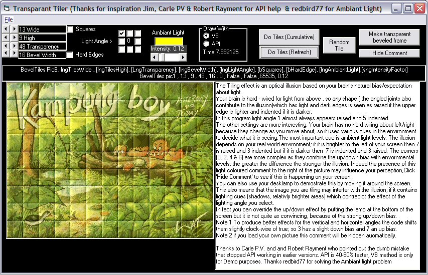



## Transparent Tiler 4

### Description

Back again. Draws coloured tiles over any picture, looks better than it sounds (see screenshot).

Ambiant light problem solved brilliantly by redbird77. API working thanks to Carle PV and Robert Rayment who both spotted my dumb mistake in passing the wrong values into the colour setting (took a while to notice it even with their help, some times your brain just won't work, eh). redbird77's code allowed me to activate the Ambiant colour parameter and add another one (Intensity). Aslo increased the number of bevels the demo allows to 200 (there is no real limit other than time) This allows you to create a single tile on a reasonably large picture giving a nice frame or curved (Hard edge Off) effect. If the bevel number is high enough the whole picture will be tinted, play with transparency and Intensity controls for best effect.

----

I have also cleaned up the code a bit (removed some unnecessary Optional parameters) and created 2 modules; one using pure VB, the other API. I recommend that if you want to use this you use the API version it is about 40 -50% faster especially with large numbers of tiles. There is a simple (and not very good) timer message so you can compare the two versions.

----

This demo takes advantage of a weakness in VB; it doesn't notice if you have Private routines with the same name in different modules, so both modules contain the some of the basic support functions. This is a potential source of bugs in code, if the 2 routines are not exact copies of each other. In this demo they are exactly the same, I could also have renamed them by adding 'VB' or 'API' to end of names as i did with other routines (which are not identical). Alternatively a single copy of the routines declared Public (in a 3rd module or either of the exiting modules) would work but would make the modules less portable.
 
### More Info
 

             |
---                |---
**Submitted On**   |2004-01-24 17:21:26
**By**             |[Roger Gilchrist](https://github.com/Planet-Source-Code/PSCIndex/blob/master/ByAuthor/roger-gilchrist.md)
**Level**          |Intermediate
**User Rating**    |4.9 (59 globes from 12 users)
**Compatibility**  |VB 6\.0
**Category**       |[Graphics](https://github.com/Planet-Source-Code/PSCIndex/blob/master/ByCategory/graphics__1-46.md)
**World**          |[Visual Basic](https://github.com/Planet-Source-Code/PSCIndex/blob/master/ByWorld/visual-basic.md)
**Archive File**   |[Transparen1698861242004\.zip](https://github.com/Planet-Source-Code/roger-gilchrist-transparent-tiler-4__1-51213/archive/master.zip)

